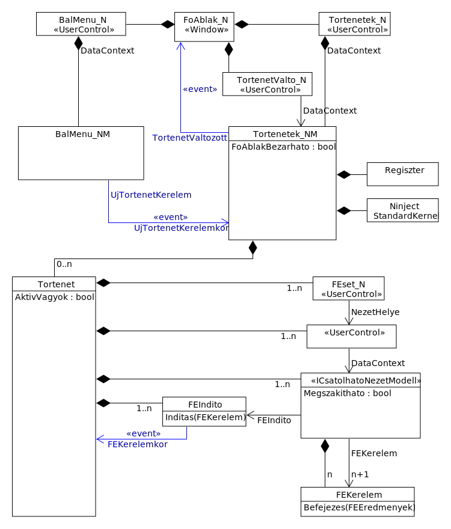

# Rendszerterv

A rendszer kialakítása során az alábbi megfontolásokat követjük.

## Rétegrend
Az alkalmazott logikákat az objektumorientált (OOP) tervezési minta szerint 
objektumokba foglaljuk.
Az így kialakított objektumokat feladatuk és ismertségi viszonyaik szerint 
a következő rétegekbe szervezzük:

### Megjelenítési réteg
Ebben a rétegben a felhasználói eseteket megvalósító objektumok helyezkednek el.
A rétegben a Nézet-NézetModell-Modell (MVVM) tervezési mintának Nézet és 
NézetModell objektumai vannak.

A Nézet szerepet betöltő objektum felügyeli a felhasználói felület látható 
elemeit megvalósító objektumok életciklusát. A Nézet hozza ezeket létre és 
szünteti meg. A Nézet köti össze őket egymással és a NézetModell egyes 
szolgáltatásaival az eseményvezérelt párbeszéd megvalósulásához.

A NézetModell szerepet betöltő objektum felügyeli a Modell szerepkört betöltő 
üzleti objektumok életciklusát.

A NézetModell tudja, hogy az adott felhasználói esethez mely üzleti objektumok 
(Modellek) és azok mely funkciói szükségesek. Ezért a NézetModell gondoskodik 
ezek létrejöttéről (egy Tároló fogyasztásával), és ezekre támaszkodva az adott 
felhasználói eset igényei szerinti szolgáltatásokat nyújt (amit a Nézet fogyaszt). 
A kapcsolat egyirányú: a NézetModell nem ismeri a Nézet objektum címét, nem 
tudja megszólítani azt. A Nézet ismeri a NézetModell címét, fogyasztja a 
szolgáltatásait, de a Modellek közül csak azokat érheti el, melyeket a NézetModell 
neki átad valamelyik szolgáltatása keretében.

### Üzleti réteg
Ebben a rétegben laknak a Modell szerepet betöltő üzleti objektumok. Ezek azokat 
a logikákat tartalmazzák, melyek felhasználói esettől függetlenek, azaz minden 
felhasználó esetre közösek.

A rétegben a Tároló (Repository) és az EgységnyiVáltozás (Unit-of-Work) tervezési 
mintát követjük.

A Tároló szerepet betöltő objektum egyforma üzleti objektumok életciklusát felügyeli.
A réteg több Tároló osztályt ismer, üzleti objektum osztályonként egyet. A Tároló 
nem ismeri az objektumok rögzítésének-betöltésének módját. Kérésre tud adni egy új 
üzleti objektumot, be tud tenni, ki tud venni egyet a gyűjteményből. Az általa 
kezelt üzleti objektumokon kívül nem ismer más objektumokat, csak mások fogyasztják 
az ő szolgáltatásait.

Az EgységnyiVáltozás szerepet betöltő objektum felügyeli az egy vagy több 
felhasználói esetben okozott, de egyetlen felhasználói jelzésre együtt rögzítendő 
változásban érintett üzleti objektumok (Modellek) életciklusát. Az EgységnyiVáltozás 
feladata a tárolási réteg szolgáltatásaira támaszkodva olyan Tárolókat adni a 
NézetModellnek, melyekben a NézetModell által kért Modellek ott vannak. Köteles 
követni a Modellekben a NézetModell vagy a Nézet vagy a Modell saját logikája 
által okozott változásokat (hozzáadás, módosítás, törlés) és kérésre azok állapotát 
a tárolási réteg szolgáltatásaival rögzíteni.

A Modell feladata tárolni az üzleti entitás adatait és megvédeni ezek összefüggéseit.
A Modellek kialakítása során a SzakterületVezérelt (DDD) tervezési mintát követjük
Korlátos Környezetek (Bounded Context) kialakításával.

### Tárolási réteg
Ebben a rétegben laknak azok az objektumok, amelyek képesek a Modellek állapotának 
rögzítésére és visszatöltésére. Ezek kötelesek elfedni az EgységnyiVáltozás és a 
Tároló elől a rögzítés megvalósításának részleteit (fájl, relációs adatbázis, 
webszolgáltatás, stb.) 

### Szolgáltatási réteg
Ebben a rétegben vannak azok az objektumok, amelyek a többi réteg objektumainak 
nyújtanak szolgáltatásokat (pl. naplózás, nyomtatás, rendszeridő, felhasználó
azonosítás és feljogosítás, stb.)


## Névtér- és Szerelvény-szervezési stratégia
Annak érdekében, hogy a kialakuló komponensek minél jobban újrafelhasználhatók
legyenek más, később megalkotandó alkalmazásokhoz, a köztük levő függőségi
viszonyokat csökkenteni kell.
Továbbá, hogy az idővel változó technológiák (UI, ORM, stb.) követhetők legyenek,
azok jellegzetességeinek átszivárgását más rétegekbe meg kell akadályozni.
Ezen célok érdekében a névtereket a Megjelenítési Rétegben felhasználói-esetcsoportok
köré szervezzük, az Üzleti- és a Tárolás Rétegben pedig a Korlátos Környezetek köré.
A szerelvényeket ezeken a névtereken *belül*, a réteghatárok és az alkalmazott
technológiák köré szervezzük.


### Szerelvények nevezéktana
A szerelvények neve három tagból áll:
- réteg (M-megjelenítési, U-üzleti, T-tárolás, S-szolgáltatási)
- funkció (megjelenítési rétegben a felhasználói esetcsoport megnevezése, üzleti- és 
tárolási rétegben a Korlátos Környezet megnevezése)
- technológia (ha azonos funkcióra különböző technológiájú megoldások állnak rendelkezésre)

A tagok között alávonás karaktert kell alkalmazni.

Példák:

|név|jelentés|
|---|---|
|M_Partner_WPF|A 'Partner' felhasználói esetcsoportba tartozó felhasználói esetek megjelenítését WPF technológiával megvalósító objektumokat tartalmazó szerelvény.
|M_Partner_ASP|A 'Partner' felhasználói esetcsoportba tartozó felhasználói esetek megjelenítését ASP.NET technológiával megvalósító objektumokat tartalmazó szerelvény.
|U_Partner|A 'Partner' Korlátos Környezetet alkotó üzleti objektumokat tartalmazó szerelvény
|T_Partner_SQL|A 'Partner' Korlátos Környezetet alkotó üzleti objektumok rögzítését relációs adatkezelő technológiával megvalósító objektumokat tartalmazó szerelvény.
|T_Partner_NoSQL|A 'Partner' Korlátos Környezetet alkotó üzleti objektumok rögzítését séma-mentes technológiával megvalósító objektumokat tartalmazó szerelvény.
|S_Tarolas_SQL|A relációs adattároláshoz szolgáltatásokat nyújtó objektumokat tartalmazó szerelvény.

### Névterek nevezéktana
Az összes felvett névteret egyetlen, saját gyökér névtérbe foglaljuk (pl.: Sajat).

A névterek két tagból állnak:
- funkció neve
- névtér típusa (FE-felhasználói eset, KK-korlátos környezet)

A technológiai függőséget alárendelt névtérrel fejezzük ki.

Példák:

|név|jelentés|
|---|---|
|Sajat.PartnerFE.WPF|A partnerekkel kapcsolatos felhasználói eseteket WPF technológiával megvalósító objektumok tartoznak ide.
|Sajat.PartnerKK|A Partner Korlátos Környezet objektumai tartoznak ide.

### Objektumok nevezéktana
Az objektumok neve:
- magyar nyelvű
- főnév
- ha összetett szó, akkor PascalCase alkalmazandó
- ha Nézet, akkor _N a vége
- ha NézetModell, akkor _NM a vége
- ha entitás, egyes szám alkalmazandó
- ha gyűjtemény, többes szám alkalmazandó

A metódusok neve:
- magyar nyelvű
- ha összetett szó, akkor PascalCase alkalmazandó
- ha nem eseménykezelő, akkor főnévi igenév -ás/-és alakja (pl.: PartnerRogzites)
- ha eseménykezelő, akkor a főnévi igenév -kor végződéssel (pl.: PartnerRogziteskor)
- `private` első karaktere kisbetű
- `public` első karaktere nagybetű

Mezők, tulajdonságok neve:
- magyar nyelvű
- főnév
- ha összetett szó, akkor PascalCase alkalmazandó
- `private` első karaktere kisbetű
- `public` első karaktere nagybetű

## Alkalmazáskeret
Az objektumok feladatát megvalósító logikák gyakran igénylik más objektumok
szolgálatait. A logika megalkotása közben azonban soha nem vélelmezhetjük,
hogy a szolgáltatást pontosan melyik másik objektum fogja majd megvalósítani
az éles rendszerben. Csak arra szabad számítani, hogy lesz ott olyan objektum,
ami nyújtja majd a szükséges szolgáltatást.

Az ilyen előrelátással megalkotott objektum-készlet olyan halmazt alkot, amelyből
egy konkrét rendszer összeállításakor szabadon megválaszthatjuk az egyes 
szükséges szolgáltatások teljesítésére a megfelelőket. Ha a szerelvények 
határait megfelelően választottuk meg, akkor egy új rendszer összeállítása a
szerelvények egyszerű összeválogatásával tud teljesülni.

Az így kiválasztott objektumok azonban még nem alkotnak rendszert, hiszen nem
is tudnak egymásról. Kell egy olyan logika, amely ismeri az adott összeállítás
elemeit, és amikor az egyik objektumnak egy bizonyos szolgálatra szüksége van,
akkor azt az objektumot nyújtja oda, amely erre ki lett választva.

Ennek a logikának kell továbbá tartania a kapcsolatot a felhasználóval, annak 
jelzései alapján indítania-befejeznie az egyes felhasználói eseteket.

Ez a logika az AlkalmazásKeret.

Az AlkalmazásKeret semmit nem tud az adott rendszer üzleti funkcióiról. Az ő
feladata: 

- számbavenni az összeválogatott felhasználói eseteket
- a választékból az indulópontokat a felhasználó elé tárni menü formájában
- a felhasználó jelzésére elindítani egy felhasználói esetet
- annak az esetnek az igényeit kiszolgálni megfelelő objektumokkal
- a felhasználó jelzése szerint további felhasználói esetet nyitni vagy az aktuálisat bezárni
- kezelni a párhuzamos modalitási láncokat

# Megvalósítás

## M_Alkalmazas_WPF
Megvalósítja az AlkalmazásKeretet.

### App
Az alkalmazás az `App` osztály példányosításával indul.

Az `App` felveszi az erőforrás-gyűjteményébe a `UresStilus.xaml`-ban
leírt stílusokat.

> Minden hivatkozott stílust fel kell venni a `UresStilus.xaml` erőforrás-gyűjteménybe
> üres tartalommal, hogy futási időben ne keletkezzen hivatkozási kivétel
> a XAML tartalmak felépítésekor.

Ezt követően feldolgozza (ha létezik) az `M_Alkalmazas_WPF_EgyenStilus.xaml` tartalmát és
felveszi másodikként az erőforrás-gyűjteményébe. A WPF fordított sorrendben
oldja fel a stílushivatkozásokat, így az egyéni stílus kerül hatályba a
felülbírált esetekben.

Példányosítja a `FoAblak` objektumot.

### FoAblak
Létrehozza a
- `BalMenu_N` és `BalMenu_NM` 
- `Tortenetek_N` és `Tortenetek_NM`
- `TortenetValto_N`

objektumokat. 

Hozzáköti a `BalMenu_NM` objektum `UjTortenetKerelem` eseményét a `Tortenetek_NM`-hez,
hogy a menüpontok kiválasztása új történet indulását eredményezhesse.

Feliratkozik a `Tortenetek_NM` `TortenetValtozott` eseményére, hogy felhasználói eset
létrejöttekor vagy megszüntekor el tudja gördíteni az ablakot az esetlánc új végéhez.

A `TortenetValto_N` `DataContext`-ét a `Tortenetek_NM`-re irányítja. Ez már
létrejött a `Tortenetek_N`-el együtt, de itt egy nézetmodellt két nézet is fogyaszt,
a másodikat már csak rá kellett kötni.

Beékelődik az ablakbezárás folyamatába. Bezáráskor megkérdezi a `Tortenetek_NM`-től, 
hogy a főablak bezárható-e (van-e bármelyik történetben rögzítetlen adatot tartalmazó
felhasználó eset). Megerősítést kér a felhasználótól a kilépéshez.

### BalMenu_NM
Felolvassa a `M_Alkalmazas_WPF_BalMenu.xml`-ből a megjelenítendő menüpontokat
(bennük az indítandó felhasználóieset-azonosítókkal)

Láncolt adatszerkezetet épít a menüpontok harmonika-elvű kezelésének támogatásához.
A felhasználói választások alapján újraképzi a látható menüpontokat.

Menüpont kiválasztásakor a `FEKerelem` objektumba csomagolja az eset azonosítót és
`UjTortenetKerelem` eseményt kelt.

### Tortenetek_NM
Létrehozza a `Regiszter` objektumot.

Felolvassa a `M_Alkalmazas_WPF_Modulok.xml` fájlból az IOC modulok listáját.
Létrehozza a Ninject `StandardKernel` objektumot átadva a modulok listáját. Az IOC
példányosítást majd a `Tortenet`-ek végzik, de a StandardKernel életciklusa
hosszabb, mint egy `Tortenet`-é, ezért itt kerül egyszer létrehozásra és minden
`Tortenet` megkapja használatra.

Gyűjteményt hoz létre a párhuzamosan futó `Tortenet`-ek nyilvántartásához.

Kérelemre új `Tortenet` objektumot hoz létre átadva a kapott `FEKerelem` objektumot.
A létrejött `Tortenet`-et gyűjteményébe felveszi, ha befejeződött,
gyűjteményéből eltávolítja.

Őrzi, hogy melyik az aktív történet. Történetváltáskor gondozza a gyűjteményében
levő `Tortenet` objektumok `AktivVagyok` tulajdonságát (ami alapján a 
`TortenetValto_N` eltérő küllemel tudja majd megjeleníteni)

Kérelemre végigkérdezi az összes történet összes felhasználói esetét, hogy a főablak
bezárható-e (van-e rögzítetlen adat).

### Regiszter
Felolvassa a `M_Alkalmazas_WPF_FEsetek.xml`-ből, hogy melyik felhasználói
eset azonosítóhoz mely szerelvények mely osztályai tartoznak.

Kérésre feloldja az azonosítót nézet és nézetmodell osztályhivatkozásokra.

### Ninject StandardKernel
IOC konténer feladatot lát el: nyilvántartja, hogy milyen interfészt milyen osztállyal
kell megvalósítani. Kérésre az igényelt interfész típusa alapján példányosít egy
megfelelő osztályú objektumot és minden olyan további objektumot, amitől az függ.

### Tortenet
Gyűjteményt hoz létre az egy modális láncot alkotó felhasználói esetek tárolásához.

Kérelemre (illetve példányosuláskor) létrehozza a felhasználói esetet megvalósító,
*Nézet* és *NézetModell* szerepkört betöltő objektumokat. Ehhez:
- a kapott `FEKerelem` objektumban található felhasználóieset-azonosítót feloldatja 
nézetosztály és nézetmodell-osztály megnevezésre (ehhez kapott egy metódust a
`Tortenetek_NM`-től, amivel hozzáfér annak `Regiszter`-éhez)
- példányosíttatja a *NézetModell* objektumot (és mindent, amitől az függ) a
`Tortenetek_NM`-től kapott Ninject `StandardKernel`-el
- megvizsgálja, hogy az így létejött objektum `ICsatolhatoNezetModell`-e
- ad egy olyan `FEIndito` objektumot a *NézetModell*-nek, melynek `FEKerelem`
eseményére feliratkozott. Igy a *NézetModell* a `FEIndito.Inditas()` metódusával
kérheti újabb felhasználói eset létrehozását
- úgy módosítja a kapott `FEKerelem` objektumot, hogy lecseréli benne az `Eredmeny`
metódust a sajátjára. Ezzel beékelődik a felhasználói esetek közötti párbeszédbe és
lehetőséget ad magának az eredménnyel végződött felhasználó esettel kapcsolatos
teendők ellátására (leiratkozni az eseményeiről, kivezetni a gyűjteményből és persze
ténylegesen továbbadni a kapott `FEEredmeny`-t a kérést eredetileg indító felhasználói
esetnek, levenni róla a tiltást)
- beteszi a *NézetModell* `FEKerelem` tulajdonságába a módosított `FEKerelem`
objektumot. Ezzel a *NézetModell* hozzájut a neki szánt paraméterekhez, ami alapján
megfelelően vezérli a belső logikáját.
- létrehoz egy `FEset_N` objektumot (ez egy üres panel a tartalom befogadásához)
- példányosítja a *Nézet* objektumot
- megvizsgálja, hogy az `UserControl`-e
- összeköti a *Nézet* `DataContext`-ét a *NézetModell*el.
- beilleszti a `FEset_N`-be a *Nézet*et
- a lánc előző elemének *Nézet*ében átállítja az `IsEnabled` tulajdonságot
`false` értékre, hogy megakadályozza a felhasználó további érintkezését az előző, 'félbeszakított'
felhasználói esettel
> A felhasználói esetek *Nézet*eiben a vizuális megjelenést biztosító objektumgráf
> `UIElement` tagjai az `IsEnabled` tulajdonság gyökértől öröklődő értékét ne írják felül!
> Ha ezt teszik, akkor kötelesek az ős tulajdonságát is figyelembe venni és megfelelően
> biztosítani, hogy a tiltás rajtuk is bekövetkezzen, a felhasználó csak az engedélyezett
> (utolsó) felhasználói eset vizuális komponenseivel tudjon érintkezni.
- beilleszti `FEset_N` objektumot a gyűjteményébe, hogy az megjelenjen vizuálisan is

Ha a fenti folyamatban hiba keletkezik, a hiba leírását egy `KivetelesHelyzet` objektumba
foglalja, és egy `FEset_N`-el ezt jeleníti meg.
 


#### Kommunikáció a felhasználói esetek között
Amikor egy történet n. felhasználói esete szeretne egy n+1-ik felhasználói esetet
indítani, akkor létre kell hozzon egy `FEKerelem` objektumot.

Az `Id`-ben meg kell adja az indítandó felhasználói eset azonosítóját.

> Az azonosítónak szerepelnie kell a `Regiszter` által felolvasott `M_Alkalmazas_WPF_FEsetek.xml`
> fájlban, különben az alkalmazáskeret nem tudja létrehozni.

A `Parameterek`-ben átadhatja azokat az értékeket, melyek szükségesek az indítandó
felhasználói eset belső logikájához.

Az `Eredmenykor`-ban egy olyan metódust kell adnia, amelyben majd fogadja az elindított
majd befejeződött felhasználói eset eredményét.

Ezzel az `FEKerelem` objektummal kell meghívja az alkalmazáskerettől kapott `FEIndito` 
objektum `Inditas()` metódusát. 

```csharp
FEIndito.Inditas(
    new FEKerelem(
        "<felhasználóieset_azonosító>",
        new FEParameterek().Parameter("<paraméter_neve>", <paraméter_értéke>),
        (eredmenyek) => {
            // eredményfeldolgozó logika
        }
    )
);
```

Az alkalmazáskeret erre létrehozza az n+1-ik felhasználói esetet és az `FEKerelem`
objektumot átadja neki. A felhasználói eset a feladata befejezését ennek `Befejezes()`
metódusának hívásával kell jelezze. Ekkor egy `FEEredmenyek` objektumban értékeket
is adhat vissza az őt hívó felhasználói esetnek.

```csharp
FEKerelem.Befejezes(
    new FEEredmenyek()
        .Eredmeny("<eredmény_neve>", <eredmény_értéke>)
);
```

Az alkalmazáskeret erre megszünteti az elindított felhasználói esetet és az `FEEredmenyek`
objektumot átadja az előző felhasználói eset eredménykezelő metódusának.
